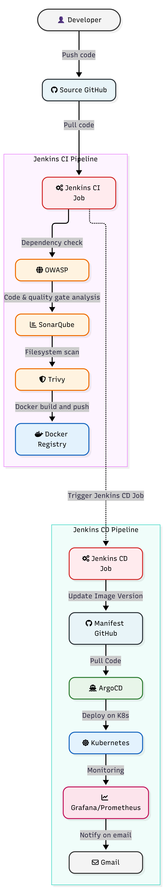
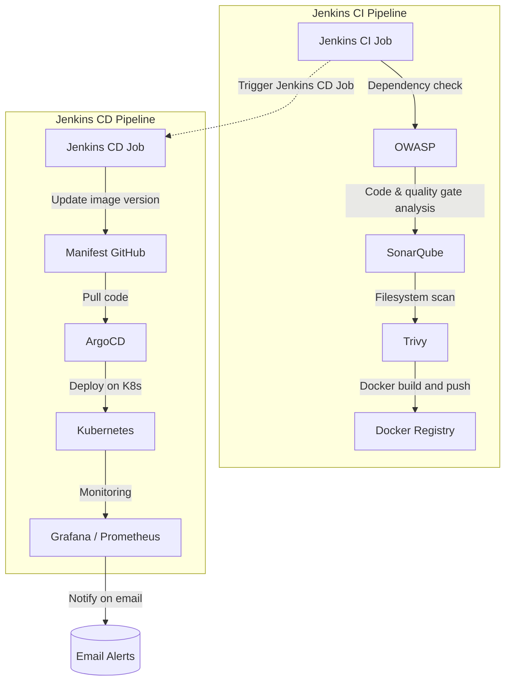

# 🔐 DecSec: End-to-End DevSecOps CI/CD Pipeline

[](#-tools--technologies)
[](#-tools--technologies)
[](#-tools--technologies)
[](#-tools--technologies)
[](#-tools--technologies)

> A hands-on DevSecOps project that takes an application from commit to production with **security scanning built into every stage**, **GitOps-based delivery**, and **real-time monitoring and alerting**.

---

## 📑 Table of Contents

- [Overview](#-overview)
- [Architecture](#-architecture)
- [Pipeline Workflow](#-pipeline-workflow)
- [Tools & Technologies](#-tools--technologies)
- [Repository Structure](#-repository-structure)
- [Prerequisites](#-prerequisites)
- [Getting Started](#-getting-started)
- [Setting Up the Pipelines](#-setting-up-the-pipelines)
- [Monitoring & Notifications](#-monitoring--notifications)
- [Security Checks at a Glance](#-security-checks-at-a-glance)
- [Cleanup](#-cleanup)
- [Contributing](#-contributing)

---

## 🧠 Overview

**DecSec** demonstrates a production-style DevSecOps workflow split into two pipelines:

1. **Jenkins CI Pipeline**: validates code and dependencies, runs quality and security gates, then builds and pushes the Docker image.
2. **Jenkins CD Pipeline**: updates the image version in the GitOps manifest repository, lets **ArgoCD** sync the change to **Kubernetes**, and reports health through **Prometheus/Grafana** with email notifications.

Infrastructure is provisioned with **Terraform**, and the application is composed of a **frontend**, a **backend** and a **database**.

---

## 🏗️ Architecture



> 💡 The image file is named `archititure.png`. If you rename it to `architecture.png`, update the path above.

The same flow as a Mermaid diagram (renders natively on GitHub):



---

## 🔄 Pipeline Workflow

### 🟣 Continuous Integration (Jenkins CI)

| # | Stage | Tool | What happens |
|---|-------|------|--------------|
| 1 | Trigger | Jenkins CI Job | Starts on a code push to the repository |
| 2 | Dependency check | **OWASP Dependency-Check** | Scans third-party libraries for known CVEs |
| 3 | Code & quality gate analysis | **SonarQube** | Static analysis for bugs, vulnerabilities, code smells and coverage |
| 4 | Filesystem scan | **Trivy** | Scans the project filesystem for vulnerabilities and secrets |
| 5 | Docker build & push | **Docker / Registry** | Builds the image and pushes it to the registry |

### 🟢 Continuous Delivery (Jenkins CD + GitOps)

| # | Stage | Tool | What happens |
|---|-------|------|--------------|
| 1 | Trigger Jenkins CD job | Jenkins | Fired automatically when CI completes |
| 2 | Update image version | Jenkins to **Manifest GitHub** | Commits the new image tag to the Kubernetes manifests |
| 3 | Pull code | **ArgoCD** | Detects the manifest change in Git |
| 4 | Deploy on K8s | ArgoCD to **Kubernetes** | Syncs the desired state to the cluster |
| 5 | Monitoring | **Prometheus + Grafana** | Collects metrics and visualises cluster/app health |
| 6 | Notify on email | Alerting | Sends email notifications on pipeline and alert events |

---

## 🛠️ Tools & Technologies

| Category | Tools |
|----------|-------|
| **CI/CD** | Jenkins (CI Job and CD Job), `Jenkinsfile` |
| **GitOps** | ArgoCD, Manifest GitHub repository |
| **Security** | OWASP Dependency-Check, SonarQube, Trivy |
| **Containers** | Docker, Docker Compose, Docker Registry |
| **Orchestration** | Kubernetes |
| **Infrastructure as Code** | Terraform |
| **Monitoring** | Prometheus, Grafana |
| **Notifications** | Email |
| **Application** | Frontend, Backend, Database (Node.js / `package.json`) |

---

## 📂 Repository Structure

```text
DecSec/
├── Assets/              # Architecture diagram and images
│   └── archititure.png
├── Automations/         # Helper / automation scripts
├── backend/             # Backend service source code
├── database/            # Database configuration and scripts
├── frontend/            # Frontend application source code
├── GitOps/              # ArgoCD application definitions
├── kubernetes/          # Kubernetes manifests (deployments, services, etc.)
├── terraform/           # Infrastructure as Code
├── docker-compose.yml   # Local multi-container setup
├── Jenkinsfile          # Pipeline definition
├── package.json         # Node.js dependencies and scripts
└── package-lock.json
```

---

## ✅ Prerequisites

- A cloud account (e.g. AWS) with permissions to create infrastructure
- [Terraform](https://developer.hashicorp.com/terraform/downloads) `>= 1.x`
- [Docker](https://docs.docker.com/get-docker/) and Docker Compose
- [kubectl](https://kubernetes.io/docs/tasks/tools/) and access to a Kubernetes cluster
- A running **Jenkins** server with these plugins: Pipeline, Git, Docker Pipeline, SonarQube Scanner, OWASP Dependency-Check, Email Extension
- A **SonarQube** server and token
- A **Docker registry** account (e.g. Docker Hub)
- A separate **GitHub manifest repository** for GitOps
- **ArgoCD** installed on the cluster

---

## 🚀 Getting Started

### 1. Run locally with Docker Compose

```bash
docker-compose up --build
```

### 2. Provision infrastructure with Terraform

```bash
cd terraform
terraform init
terraform plan
terraform apply -auto-approve
```

### 3. Install dependencies (Node.js)

```bash
npm install
```

---

## ⚙️ Setting Up the Pipelines

### Jenkins credentials to configure

| Credential ID | Purpose |
|---------------|---------|
| `sonar-token` | SonarQube authentication |
| `docker-cred` | Docker registry login |
| `github-cred` | Push to the manifest repository |
| `email-cred` | SMTP for notifications |

> Adjust the IDs to match the ones referenced in your `Jenkinsfile`.

### CI pipeline

1. Create a Jenkins **Pipeline** job pointing at this repository's `Jenkinsfile`.
2. Run the job. It will execute OWASP, SonarQube, Trivy, then build and push the Docker image.

### CD pipeline

1. Create a second Jenkins job (CD) that is triggered by the CI job.
2. It updates the image tag in the manifest GitHub repository.
3. ArgoCD detects the change and deploys to Kubernetes:

```bash
kubectl apply -f GitOps/
kubectl get pods -n <namespace>
```

---

## 📊 Monitoring & Notifications

- **Prometheus** scrapes metrics from the cluster and application.
- **Grafana** dashboards visualise resource usage, pod health and request metrics.
- **Email notifications** are sent on pipeline results and alerts.

```bash
# Example: access Grafana locally
kubectl port-forward svc/grafana 3000:80 -n monitoring
```

---

## 🛡️ Security Checks at a Glance

| Layer | Tool | Detects |
|-------|------|---------|
| Dependencies | OWASP Dependency-Check | Vulnerable libraries (CVEs) |
| Source code | SonarQube | Bugs, vulnerabilities, code smells, quality gate failures |
| Filesystem | Trivy | Vulnerabilities, misconfigurations, secrets |
| Delivery | GitOps (ArgoCD) | Drift between Git and cluster state |

---

## 🧹 Cleanup

```bash
docker-compose down -v
cd terraform && terraform destroy -auto-approve
```

---

## 🤝 Contributing

Contributions are welcome!

1. Fork the repository
2. Create a feature branch: `git checkout -b feature/your-feature`
3. Commit your changes: `git commit -m "Add your feature"`
4. Push the branch: `git push origin feature/your-feature`
5. Open a Pull Request

---

## ⭐ Support

If you found this project useful, please consider giving it a star!